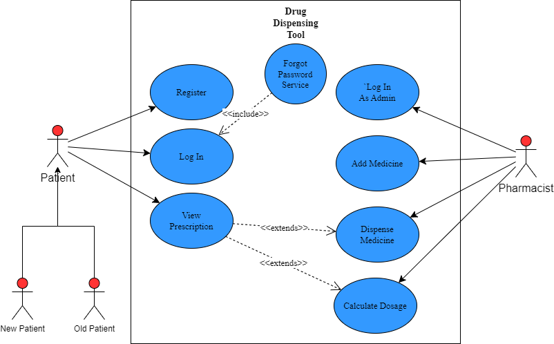
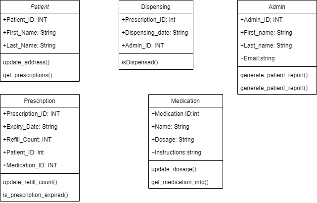

# DRUG DISPENSING TOOL

A simple web based application that provides an interface that enables customers to access **pharmaceutical products** as displayed by the website owners.

## Requirements

- [x] Login System
- [x] Registration System
- [ ] Forgot Password Service
- [x] Admin's Interface
  - [x] Admin's Table
- [x] Doctor Interface
  - [x] Doctor's Table
  - [x] Search For Patient Functionality
- [x] Pharmacist's Interface
  - [x] Pharmacist's Table
  - [x] View All Outrolled Prescriptions
- [x] Patient Interface
  - [x] Patient Table
    - [x] Should Have a Foreign Key, Linking it to the Drug's Table (One To Many Relationship - Where a Patient can have a number of prescriptions, and one prescription is linked to only one patient)
  - [x] Patient's Prescriptions
  - [x] Patient's History (SQL Views)
- [x] Drugs To Be Displayed
  - [x] Drugs Database
- [x] Prescription Service
- [x] Dispensing Service
- [x] History
- [x] [ER-Diagram](#er-diagram "Goto ER-Diagram") Needs Updating
- [x] [Use-Case-Diagram](#use-case-diagram "Goto Use-Case Diagram") Needs Updating
- [x] [UML-Class Diagram](#uml-class-diagram "Goto UML-Class Diagram")
- [x] Wireframes

## ER-Diagram

## Use-Case Diagram

## UML-Class Diagram

## Mobile Wireframe

  

## Desktop Wireframe

