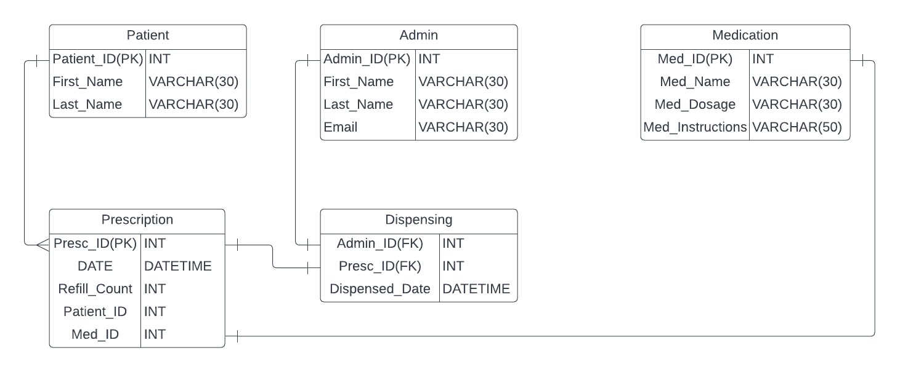

# DRUG DISPENSING TOOL

A simple web based application that provides an interface that enables customers to access **pharmaceutical products** as displayed by the website owners.

## Requirements

- [ ] Login System
- [ ] Registration System
- [ ] Forgot Password Service
- [ ] Admin Site
  - [ ] Admin Database
- [x] [ER-Diagram](##ER-Diagram "Goto ER-Diagram")
- [ ] Patient Interface
  - [ ] Patient Database
- [ ] Products(Medicine) To Be Displayed
  - [ ] Products Database
- [x] [Use-Case-Diagram](##Use-Case-Diagram "Goto Use-Case Diagram")
- [x] [UML-ClasS Diagram]()

## ER-Diagram

## Use-Case Diagram

## UML-Class Diagram

